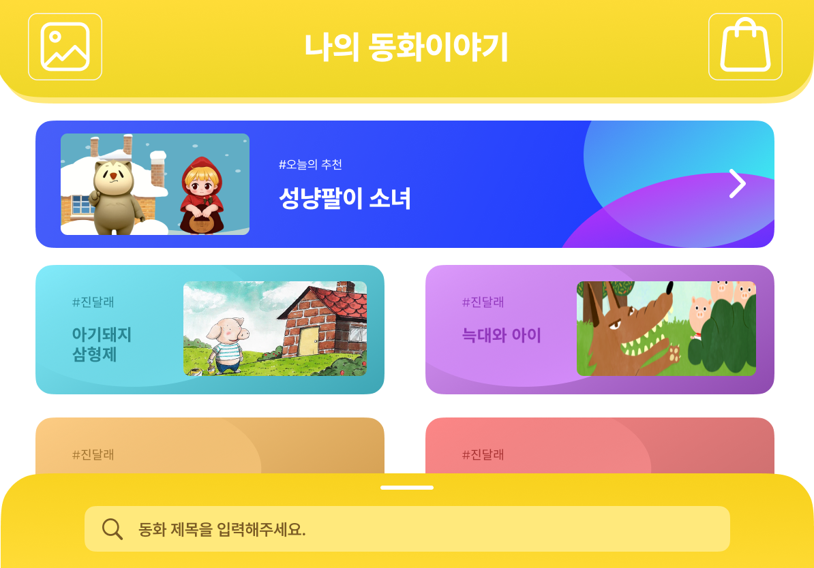
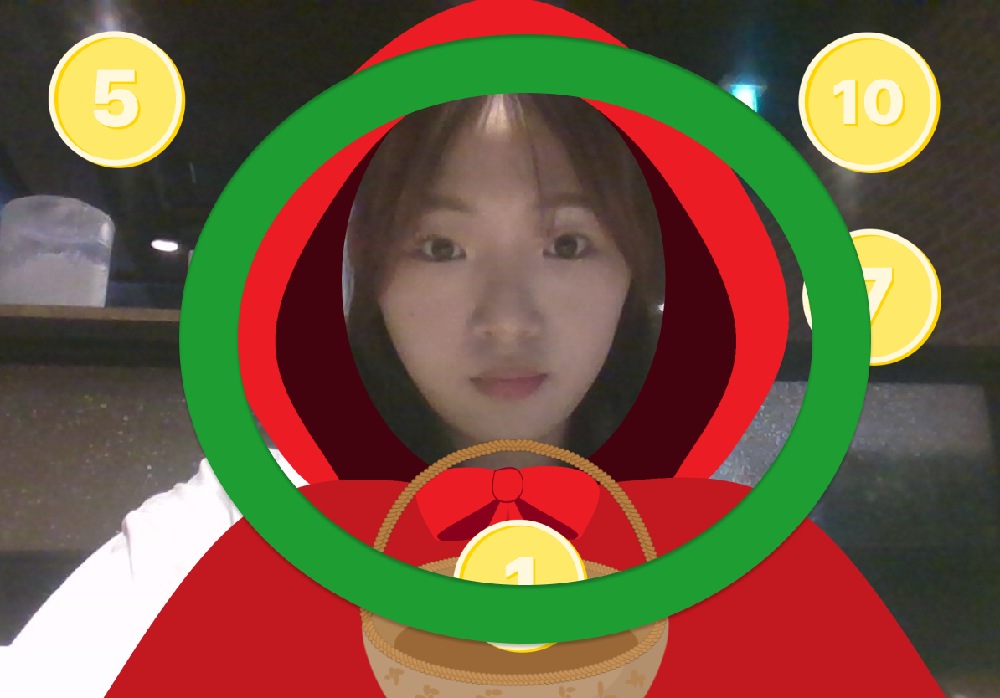
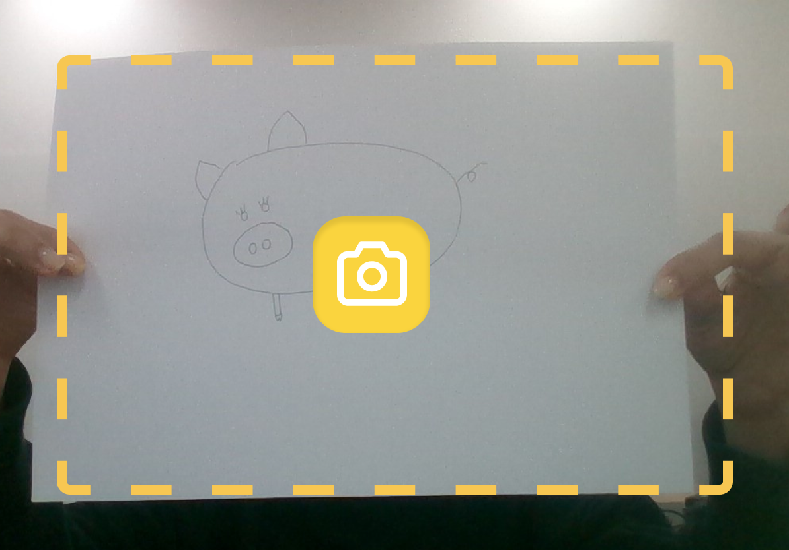

# 👸 매일 듣는 동화 이야기
**프로젝트 기간 :** `2024. 04. 09` - `2024. 04. 26`

**framework :**    

  

# 🔖 Start Guide
    python 3.11.7 # 7 이상 버전
    pip install -r requirement.txt
    pip install pydub simpleaudio # 오류 발생 가능

 

## pip install pydub 오류 발생 시
1) `Microsoft Visual C++ Build Tools` 설치

**참고 :** https://visualstudio.microsoft.com/ko/visual-cpp-build-tools/

**설치 시 "C++ 데스크톱 개발" 워크로드를 포함**

2) `ffmpeg` 환경변수 설정
   - `ffmpeg` 설치
   
**참고 :** https://kminito.tistory.com/108#google_vignette

3) 재부팅 후 `pip install pydub` 재실행

 

### Running
    python -m venv myvenv
    # 가상환경 접속
    source /myvenv/bin/activate
    # Needed pip 설치 
    cd /Dproject
    python manage.py runserver

  

#  📝 프로젝트 개요
> **이미지 인식 기술과 모션 트래킹을 활용한 창작 동화**

 

### 문제 의식
- 유아 학습 효과를 높이기 위해 동화 기반 콘텐츠의 중요성을 강조
- 전통적인 스토리텔링에 대한 부재

### 가치
- 기술을 통해 유저와 컨텐츠가 상호작용하며, 특별한 체험학습을 통해 호기심과 창의성을 만족시키는 것

### 목표
- 이미지 인식 기술과 모션 트래킹을 활용하여 유아가 직접 창작물 및 반응할 수 있는 컨텐츠 제작

  
| 사용자 | 서비스 메인 컬러 | 서비스 로고 |
|---|---|---|
| 5-7세 유아 |  **Yellow `#FFDC38`** |  |

  
| 메인화면 | 이미지 인식 기술 | 모션 트래킹 |
|---|---|---|
|  |  |  |

  

# 팀원 및 역할
### PM   
|       이름       | 역할                           |
| ------------- | ---------------------------------- | 
| 정하민 | 프로젝트 팀장 |
| 조나희 | UI, UX 디자인 |
| 임희승 | 컨텐츠 제작 |

### Develop
| 이름                             | 역할|
| ---------------------------------- | ------- | 
| 송희도 | 개발 PL, DB 구축, 웹 제작 및 배포 |
| 윤소현 | 모션인식,  웹 배포 ||
| 이수현 | 모션인식, 프론트 |
| 박수아 | 영상처리, 프론트 |
| 조서현 | 이미지 전처리,  웹 제작 및 배포 |

  

# 기타
| 기획서 | 개발 문서 | FIGMA |
|---|---|---|
|  [: 기획서 바로가기](https://docs.google.com/presentation/d/1HNkpyD14DehrC5HX0xRjjt9pCOVeQ_kOzbrUtWYKWOs/edit?usp=sharing "기획서")|  [: 개발 문서 바로가기](https://drive.google.com/file/d/1qCJREg2ePCwe8FxI8i0uIsMqt5f-Fuoa/view?usp=sharing "개발문서") |  [: FIGMA 바로가기](https://www.figma.com/file/NlNpKpsTQgHqsgKHgR1YgQ/%EC%84%B1%EB%83%A5%ED%8C%94%EC%9D%B4-%EC%86%8C%EB%85%80?type=design&node-id=1%3A3&mode=design&t=IGUO9agunTbuli8r-1 "Figma") |

  